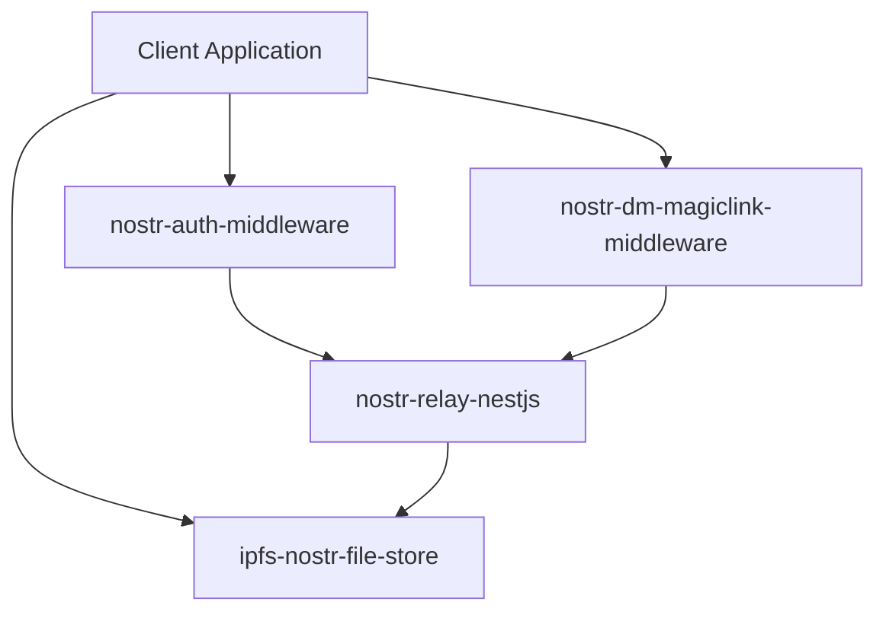

# Nostr DM Magic Link Middleware

[](https://github.com/HumanjavaEnterprises/nostr-dm.magiclink-middleware/blob/main/LICENSE)
[](https://www.npmjs.com/package/nostr-dm-magiclink-middleware)
[](https://github.com/HumanjavaEnterprises/nostr-dm.magiclink-middleware/issues)
[](https://github.com/HumanjavaEnterprises/nostr-dm.magiclink-middleware/stargazers)
[](https://www.typescriptlang.org/)
[](https://nodejs.org/)
[](https://makeapullrequest.com)

A middleware for handling magic link authentication via Nostr DMs. This package provides a secure way to implement passwordless authentication using Nostr's direct messaging system.

## Part of the Nostr Ecosystem

This middleware is part of a larger ecosystem of Nostr-related services:

- [nostr-auth-middleware](https://github.com/HumanjavaEnterprises/nostr-auth-middleware) - Authentication middleware for Nostr
- [nostr-dm-magiclink-middleware](https://github.com/HumanjavaEnterprises/nostr-dm.magiclink-middleware) - Magic link authentication via Nostr DMs (this package)
- [nostr-relay-nestjs](https://github.com/HumanjavaEnterprises/nostr-relay-nestjs) - NestJS-based Nostr relay implementation
- [ipfs-nostr-file-store](https://github.com/HumanjavaEnterprises/ipfs.nostr-file-store) - IPFS-based file storage for Nostr

These services can be used independently or together to create a full-featured Nostr application stack:



## Features

- 🔐 Secure magic link generation and verification
- 📨 Delivery via encrypted Nostr DMs
- 🔑 Built-in session management
- 🚀 Easy integration with Express.js
- 📦 TypeScript support
- ⚡ Async/await API
- 🤝 Works seamlessly with other Nostr services
- 📁 Compatible with IPFS file storage

## Installation

```bash
npm install nostr-dm-magiclink-middleware
```

## Quick Start

```typescript
import express from 'express';
import { createNostrMagicLink } from 'nostr-dm-magiclink-middleware';

const app = express();
app.use(express.json());

// Initialize the middleware
const magicLink = createNostrMagicLink({
  privateKey: process.env.NOSTR_PRIVATE_KEY!, // Your bot's private key
  baseUrl: 'https://your-app.com/auth',       // Your auth endpoint base URL
  relayUrl: 'wss://relay.damus.io',           // Optional: custom relay URL
  tokenExpiry: 5 * 60 * 1000                  // Optional: token expiry in ms (default: 5 minutes)
});

// Endpoint to initiate login
app.post('/auth/login', magicLink.initiate);

// Endpoint to verify magic link
app.get('/auth/verify', magicLink.verify, (req, res) => {
  // User is now verified
  const { npub, sessionId } = req.nostr;
  
  // Create user session, JWT, etc.
  res.json({
    success: true,
    message: 'Authentication successful',
    npub
  });
});

// Cleanup when shutting down
process.on('SIGTERM', async () => {
  await magicLink.cleanup();
});
```

## Integration Examples

### With nostr-auth-middleware

```typescript
import { createNostrAuth } from 'nostr-auth-middleware';
import { createNostrMagicLink } from 'nostr-dm-magiclink-middleware';

const auth = createNostrAuth({ /* config */ });
const magicLink = createNostrMagicLink({ /* config */ });

app.use('/auth', auth.router);
app.use('/magic-link', magicLink.router);
```

### With Custom Relay and IPFS

```typescript
import { createNostrMagicLink } from 'nostr-dm-magiclink-middleware';
import { createIpfsNostrStore } from 'ipfs-nostr-file-store';

const magicLink = createNostrMagicLink({
  privateKey: process.env.NOSTR_PRIVATE_KEY!,
  baseUrl: 'https://your-app.com/auth',
  relayUrl: 'wss://your-relay.com', // Your nostr-relay-nestjs instance
});

const ipfsStore = createIpfsNostrStore({
  ipfsNode: 'https://your-ipfs-node.com',
  relayUrl: 'wss://your-relay.com',
});

// Now you can use both services together
app.use('/auth', magicLink.router);
app.use('/files', ipfsStore.router);
```

## How It Works

1. User requests login with their Nostr public key (npub)
2. Middleware generates a secure magic link
3. Link is sent via encrypted Nostr DM to the user
4. User clicks the link in their Nostr client
5. Middleware verifies the link and authenticates the user

## Security Features

- ✅ Encrypted DMs using NIP-04
- ✅ One-time use tokens
- ✅ Configurable token expiry
- ✅ Session-based verification
- ✅ Automatic cleanup of expired sessions

## Documentation

For detailed documentation, check out:

- [Testing Nostr Services](docs/testing-nostr-services.md) - Learn about testing strategies, common challenges, and best practices
- [API Reference](docs/api-reference.md) - Detailed API documentation
- [Security Guide](docs/security-guide.md) - Security best practices and considerations

## Contributing

Contributions are welcome! Please feel free to submit a Pull Request. Check out our [Contributing Guide](CONTRIBUTING.md) for more details.

## Related Projects

- [nostr-auth-middleware](https://github.com/HumanjavaEnterprises/nostr-auth-middleware)
- [nostr-relay-nestjs](https://github.com/HumanjavaEnterprises/nostr-relay-nestjs)
- [ipfs-nostr-file-store](https://github.com/HumanjavaEnterprises/ipfs.nostr-file-store)

## License

MIT
